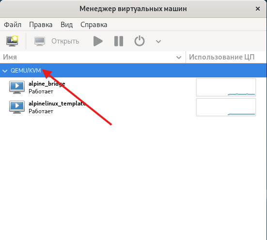

# Лабораторная работа по теме ""

## Дополнительные материалы
- [Синтаксис Markdown](./extra/markdown-and-extensions.md)
- [Основные команды и работа в терминале Linux](./extra/cli-commands.md)
- [Система контроля версий Git](./extra/git.md)
- [SSH](./extra/ssh.md)

## Требования к выполнению работы

- Компьютер с операционной системой Debian и установленным гипервизором KVM
- Образ диска ВМ **nocloud_alpine-3.23.3-x86_64-bios-tiny-r0.qcow2**

## Цель работы

- Научиться создавать и использовать виртуальные сети

## Подготовка к проведению практической работы 

### Подготовка виртуальной машины для клонирования


Задать пароль для учетной записи суперпользователя **root** задав его в файле [./customize.sh](./customize.sh) (переменная **ROOT_PASSWORD**) или использовать пароль **password**.

Запускаем скрипт командой:
```bash
bash ./customize.sh
```

Создать ВМ в  **Мененеджер Виртуальных Машин (Virtual Manager)** создать виртуальную машину, для этого:
- На первом шаге выбрать "Импорт образадиска"
- На втором шаге выбрать диск **alpine-vnet-template.qcow2** в пуле **Images**, а также указать **Alpine 3.12** в качестве операционной машины.
- На третьем шаге задать количество ОЗУ равное 1ГБ (1024ГБ) и количество vCPU равное 1.
- На четвертом шаге задать имя ВМ **alpinelinux_template**

Далее дождаться загрузки ОС ВМ (может занять несколько минут).

После загрузки системы необходимо проверить ОС ВМ на работоспособность выполнив вход в систему под суперпользователем **root**.

Также необходимо выполнить вход в ВМ по **ssh**, выполнив команду:

```bash
ssh root@<ip-address-vm>
```

Если вход выполняется успешно и подключение по **ssh** работает следует выключить ВМ и можно приступать к основной части.

## Проведение лабораторной работы

### Создание ВМ c сетевым интерфейсом bridge
Необходимо создать клон ВМ **alpinelinux_template** с именем **alpine_bridge**.

Далее необходимо открыть окно конфигурации ВМ **alpine_bridge** и изменить ссетевой интерфейс ВМ. Для этого выбираем виртуальный сетевой интерфейс, например **NIC:ee:9d:14** и в открывшемся окне:
- В пункте **Создать на базе** выбрать **Устройство моста**, а в поле устройство моста ввести **br0**. Остальные поля следует не изменять. Для применения изменений нажать кнопку **Применить** и включить ВМ.

Далее посмотреть любым удобным способом IP адрес ВМ и записать его в разделе [Полученные результаты](#полученные-результаты).

### Создание дополнительной сети типа NAT

В главном окне **Мененеджер Виртуальных Машин (Virtual Manager)** нажать на текущем подключении к гипервизоре (красная стрелка)  ПКМ и выбрать **Подробности**. Далее перейти в **Виртуальные сети** и нажать кнопку добавить. В открывшемся окне необходимо задать следующие параметры:
- название **lab-net-nat**
- режим **NAT**
- Перенапрвлять на **Любое физическое устройство**

Далее раскрыть список **Конфигурация IPv4** и задать следующие параметры:
- Включить IPv4 
- Сеть **10.0.10.0/24**
- Включить DHCP
- Начало диапазона адресов для выдачи по DHCP **10.0.10.128**
- Конец диапазона адресов для выдачи по DHCP **10.0.10.254**

По завершению нажать готово.

### Создание ВМ с сетевым интерфейсом к подключенной сети lab-net-nat

Необходимо создать 2 клона ВМ **alpinelinux_template** с именами **alpine_nat_1** и **alpine_nat_2**.

Далее необходимо открыть окно конфигурации ВМ **alpine_nat_1** и изменить ссетевой интерфейс ВМ. Для этого выбираем виртуальный сетевой интерфейс, например **NIC:ee:9d:14** и в открывшемся окне:
- В пункте **Создать на базе** выбрать **Виртуальная сеть 'lab-net-nat': NAT**.

Также следует изменить виртуальный интерфейс и ВМ **alpine_nat_2**.

После чего необходимо включить обе ВМ.

Далее посмотреть любым удобным способом IP адрес созданных ВМ и записать их в разделе [Полученные результаты](#полученные-результаты).

### Создание дополнительной сети типа Маршрутизируемая

В главном окне **Мененеджер Виртуальных Машин (Virtual Manager)** нажать на текущем подключении к гипервизоре (красная стрелка)  ПКМ и выбрать **Подробности**. Далее перейти в **Виртуальные сети** и нажать кнопку добавить. В открывшемся окне необходимо задать следующие параметры:
- название **lab-net-route**
- режим **Маршрутизация**
- Перенапрвлять на **Любое физическое устройство**

Далее раскрыть список **Конфигурация IPv4** и задать следующие параметры:
- Включить IPv4 
- Сеть **10.0.11.0/24**
- Включить DHCP
- Начало диапазона адресов для выдачи по DHCP **10.0.11.128**
- Конец диапазона адресов для выдачи по DHCP **10.0.11.254**

По завершению нажать готово.

### Создание ВМ с сетевым интерфейсом к подключенной сети lab-net-route

Необходимо создать 2 клона ВМ **alpinelinux_template** с именами **alpine_route_1** и **alpine_route_2**.

Далее необходимо открыть окно конфигурации ВМ **alpine_route_1** и изменить ссетевой интерфейс ВМ. Для этого выбираем виртуальный сетевой интерфейс, например **NIC:ee:9d:14** и в открывшемся окне:
- В пункте **Создать на базе** выбрать **Виртуальная сеть 'lab-net-route': Маршрутизируемая**.

Также следует изменить виртуальный интерфейс и ВМ **alpine_route_2**.

После чего необходимо включить обе ВМ.

Далее посмотреть любым удобным способом IP адрес созданных ВМ и записать их в разделе [Полученные результаты](#полученные-результаты).

### Проверка доступности узлов и сети интернет

На каждой созданной включенной ВМ (**alpine_bridge**, **alpine_nat_1**, **alpine_nat_2**, **alpine_route_1**, **alpine_route_2**) выполнить проверку доступности других ВМ, а также доступности хоста и с Хоста.

Например, на **Хосте** (ваш компьютер) выполнить команду: 
```bash
ping <ip-alpine_bridge>
```
И наоборот, на ВМ **ip-alpine_bridge** выполнить команду:
```bash
ping <ip-host>
```
А также выполнить проверку доступности сети Интернет командой:
```bash
ping vshte.ru
```
Стоит заметить, что при отсутствии соединения, команда пинг в **stdOut** ничего не отдаст (будет пусто). Завершение выполнения выполняется сочетанием **Ctrl+C**, после чего будет показана статистика, в том числе количество неудачных попыток.

Для удобства можно воспользоваться скриптом [check_network.sh](./check_network.sh). Для этого необходимо вписать IP адреса ВМ в скрипте в значения соответствующих переменных.

Для запуска скрипта можно использовать команду

```bash
ssh root@<ip-address-vm> "sh -s" < check_network.sh
```

Полученные результаты в виде есть соединение (Y) или нет соединений (N) записать в [Полученные результаты](#полученные-результаты).

### Добавление маршрута на alpine_bridge в сети lab-net-route и lab-net-nat

Для добавления маршрута в сеть **lab-net-route** в терминале ВМ **alpine_bridge** выполнить команду, где **ip-addr-host** ip адрес Хоста:

```bash
ip r add 10.0.11.0/24 via ip-addr-host dev eth0
```
Подсказка: ip адрес интефейса br0.

После этого проверим доступность узлов **alpine_route_1** и **alpine_route_2** выполнив команду в том же терминале ВМ **alpine_bridge**:

```bash
ping ip-address-vm
```

Для добавления маршрута в сеть **lab-net-nat** в терминале ВМ **alpine_bridge** выполнить команду, где **ip-addr-host** ip адрес Хоста:

```bash
ip r add 10.0.11.0/24 via ip-addr-host dev eth0
```

Полученные результаты проверки записать в разделе [Полученные результаты](#полученные-результаты).

### Полученные результаты

- ФИО:

- Группа:


- Интерфесы, IP адреса и сети Хоста:
**ПРИМЕР ens4 10.0.10.12 10.0.10.0/24. Интерфейсы без IP адреса, а также lo,  можно не указывать**
- Интерфесы, IP адреса и сети ВМ **alpine_bridge**:

- Интерфесы, IP адреса и сети ВМ **alpine_nat_1**: 

- Интерфесы, IP адреса и сети ВМ **alpine_nat_2**: 

- Интерфесы, IP адреса и сети ВМ **alpine_route_1**: 

- Интерфесы, IP адреса и сети ВМ **alpine_route_2**: 

- Проверка доступности (ping) с **Host**:
    * Host: Y **Пример Доступно**
    * alpine_bridge:
    * alpine_nat_1:
    * alpine_nat_2:
    * alpine_route_1:
    * alpine_route_2:
    * vshte.ru

- Проверка доступности (ping) с **alpine_bridge**:
    * Host:
    * alpine_nat_1:
    * alpine_nat_2:
    * alpine_route_1:
    * alpine_route_2:
    * vshte.ru

- Проверка доступности (ping) с **alpine_nat_1**:
    * Host: 
    * alpine_bridge:
    * alpine_nat_2:
    * alpine_route_1:
    * alpine_route_2:
    * vshte.ru

- Проверка доступности (ping) с **alpine_nat_2**:
    * Host:
    * alpine_bridge:
    * alpine_nat_1:
    * alpine_route_1:
    * alpine_route_2:
    * vshte.ru

- Проверка доступности (ping) с **alpine_route_1**:
    * Host:
    * alpine_bridge:
    * alpine_nat_1:
    * alpine_nat_2:
    * alpine_route_2:
    * vshte.ru

- Проверка доступности (ping) с **alpine_route_2**:
    * Host:
    * alpine_bridge:
    * alpine_nat_1:
    * alpine_nat_2:
    * alpine_route_1:
    * vshte.ru

- После добавления маршрута стал ли доступен сузла **alpine_bridge** узел **alpine_nat_1**:
- После добавления маршрута стал ли доступен сузла **alpine_bridge** узел **alpine_nat_2**:
- После добавления маршрута стал ли доступен сузла **alpine_bridge** узел **alpine_route_1**:
- После добавления маршрута стал ли доступен сузла **alpine_bridge** узел **alpine_route_2**:

- Если после добавления маршрутов какой то из узлов остался не доступен с **alpine_bridge**, то ответьте на вопрос: Почему узлы остались недоступными?
